  

    

  # ⚡ Hi there, I'm Dalil Moulay Abdelhakim 👋

  

    

  
  
  

---

### 👨‍💻 About Me

I am a passionate **Computer Science Engineer** dedicated to engineering high-performance mobile applications, scalable full-stack web platforms, and integrating **Intelligent Systems (AI & IoT)** to solve complex real-world challenges.

* 🎓 **Degree**: State Engineer in Computer Science
* 💡 **Core Expertise**: Web Systems Architecture, Mobile Engineering, AI Integration, Hardware/IoT Solutions
* 🌱 **Currently Focused On**: Scalable Cloud Architectures, Embedded Systems & Machine Learning Integration

---

## 🛠️ Tech Stack & Capabilities

### 💻 Backend & Web Architecture

### 📱 Mobile & Hardware (IoT)

### 🔧 Tools, DevOps & Environment

---

## 🚀 Featured Projects

| Project | Description | Stack | Link |
| :--- | :--- | :---: | :---: |
| **🛍️ Youssi Market** | Multi-vendor e-commerce platform localized for Algerian commerce across all 58 provinces. | `Laravel` `PHP` `MySQL` | [Visit Site](https://youssi-market.com) |
| **📊 AMD Tijartek** | Professional business management solution tailored for commerce tracking and retail operations. | `PHP` `Laravel` `Web` | [View Project](https://dlportfolio.youssi-market.com/portfolio/2) |
| **📱 ADNM (Atini DecheNatik Masrof)** | Mobile application built for Android, launched on Google Play Store. | `Kotlin` `Android` | [Play Store](https://play.google.com/store/apps/details?id=com.dldevalopement.adnm) |
| **🔑 DL-License Manager** | Standalone software licensing and validation system engineered for securing digital products. | `Python` `Laravel` `Security` | [View System](https://dlportfolio.youssi-market.com/portfolio/5) |
| **🌐 DLPortfolio** | Dynamic portfolio and CV generator system built on top of Laravel for personal branding. | `Laravel` `PHP` `JS` | [Live Demo](http://dlportfolio.youssi-market.com) |

---

## 📊 GitHub Analytics & Activity

  
  

    

  

---

## 🐍 My Contribution

  <picture>
    <source media="(prefers-color-scheme: dark)" srcset="https://raw.githubusercontent.com/dalil-moulayabdelhakim-dev/dalil-moulayabdelhakim-dev/output/github-contribution-grid-snake-dark.svg" />
    <source media="(prefers-color-scheme: light)" srcset="https://raw.githubusercontent.com/dalil-moulayabdelhakim-dev/dalil-moulayabdelhakim-dev/output/github-contribution-grid-snake.svg" />
    
  </picture>

---

  Designed & Developed with ❤️ by Dalil Moulay Abdelhakim

